# FoundIt – Lost & Found Mobile Application  

**Prepared for:** Dr Ahmad Iqbal Hakim Bin Suhaimi  
**Developed by:**  
- Mohammad Haris Haiqal Bin Othman (2023213578)  
- Nur Afiqah Binti Noordin (2023299132)  
- Nur Syafi'ah Adriena Binti Alidza (2023689932)  
- Mas Azra Athirah Binti Mohd Azahari (2023436008)  

---

## Overview  
FoundIt is a community-driven mobile application designed to simplify the process of reporting and recovering lost items. By leveraging real-time GPS, interactive maps, and instant notifications, FoundIt connects people who have lost belongings with those who have found them, making the lost-and-found process efficient and user-friendly.

---

## Key Features  
- **Real-time Notifications** – Instant alerts for lost/found reports.  
- **GPS & Map Integration** – Precise location tagging and interactive map view.  
- **Camera Upload** – Upload photos for easy identification.  
- **Direct Call** – Quick contact via phone.  
- **Secure Authentication** – Email/password login for data safety.  
- **Online Database** – Searchable, real-time repository of items.  

---

## Target Stakeholders  
- **General Users** – Individuals who have lost or found personal belongings.  

---

## Application Screenshots  

### Authentication & Profile Pages  
| Page | Screenshot | Description |
|------|------------|-------------|
| Register Page | 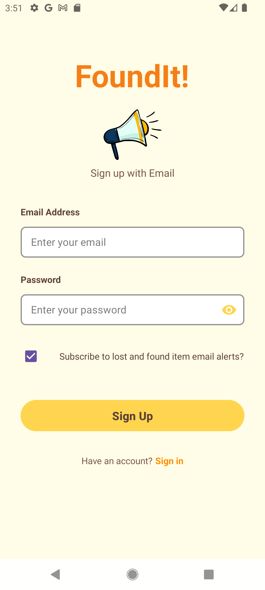 | User registration interface |
| Login Page | 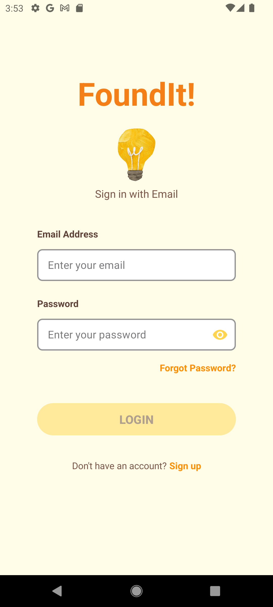 | User login interface |
| Profile Page | 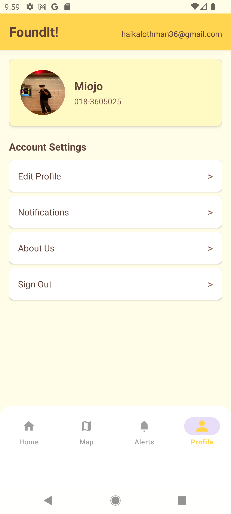 | User profile management |
| Edit Profile Page | 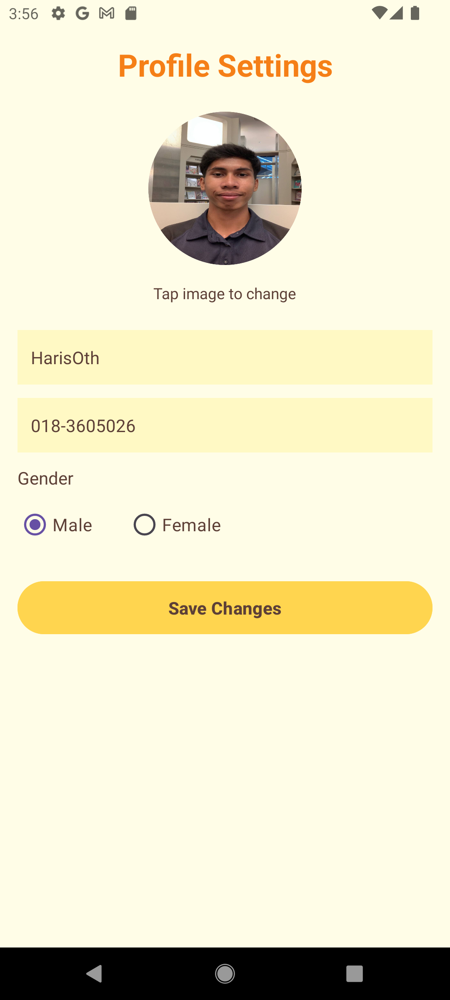 | Edit user profile details |

### Main Application Pages  
| Page | Screenshot | Description |
|------|------------|-------------|
| Home Page | 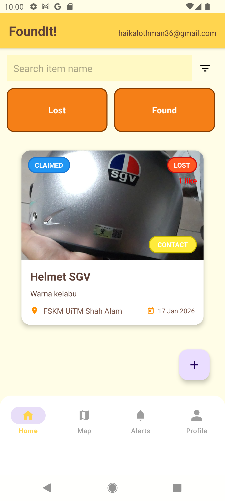 | Main dashboard and navigation |
| Map Page | 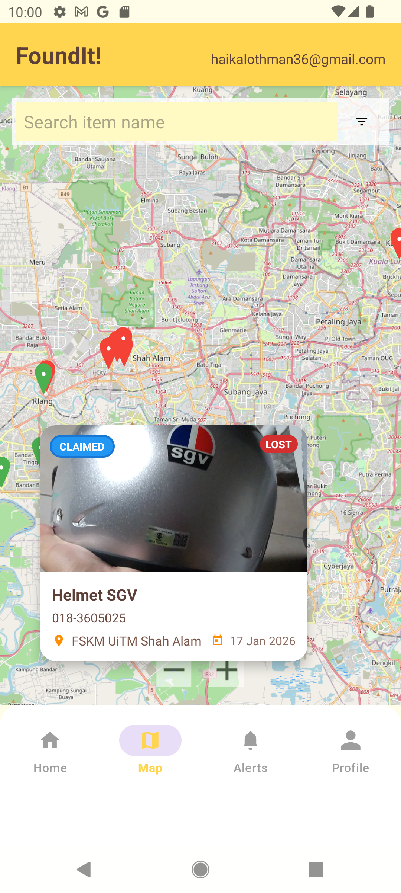 | Interactive map with lost/found items |
| Alerts Page | 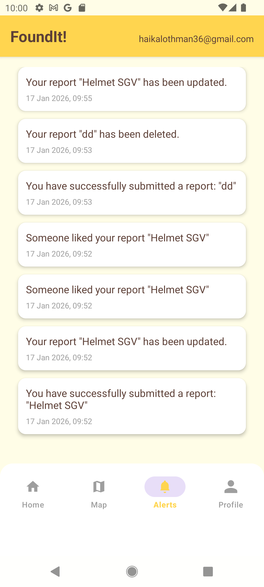 | Notifications and alerts view |

### Report Management Pages  
| Page | Screenshot | Description |
|------|------------|-------------|
| Upload Report Page | 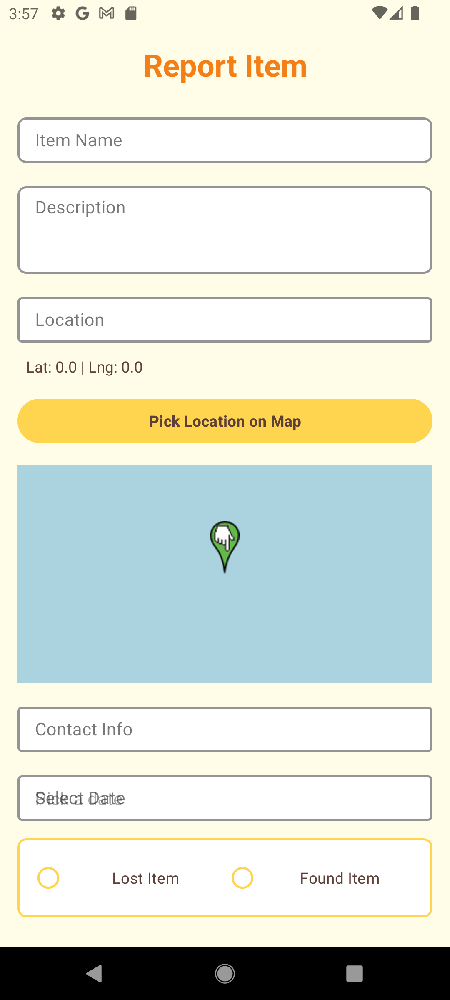 | Submit new lost/found report |
| Update Report Page | 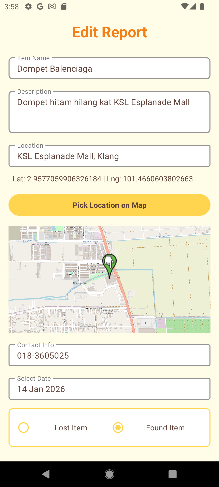 | Edit existing reports |

### Settings & Information Pages  
| Page | Screenshot | Description |
|------|------------|-------------|
| Notification Setting Page | 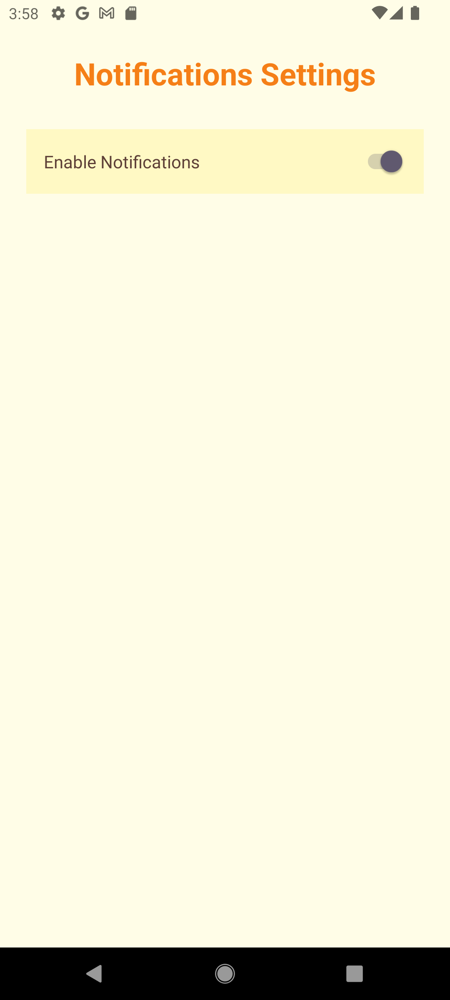 | Configure notification preferences |
| About Us Page | 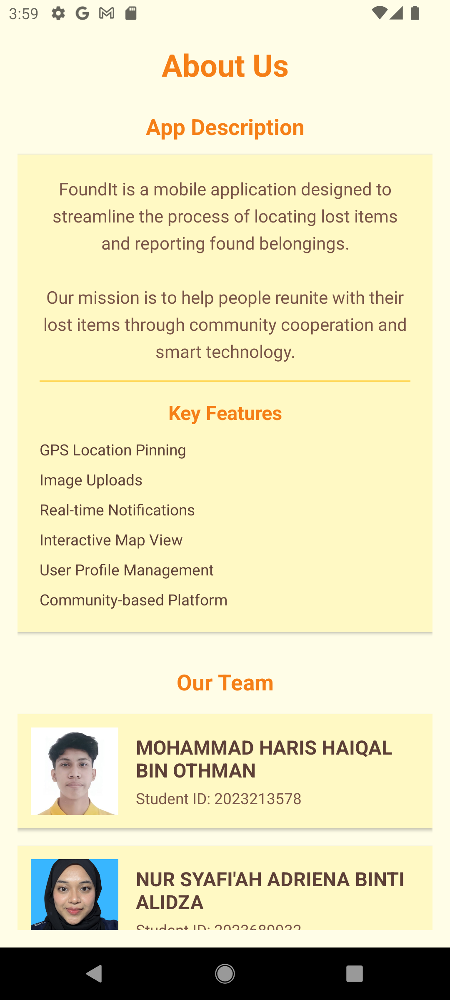 | Application information and team details |

---

## Installation  

1. Click the **"Code"** button on this repository  
2. Select **"Download ZIP"**  
3. Extract the ZIP file to your preferred directory  
4. Open the project in Android Studio / Xcode / your preferred IDE  

---

## How to Use This App

### REPORTING A LOST/FOUND ITEM
1. Tap the **+ (Add)** Icon on the Home Page
2. Fill in Item Details:
   - **Item Name:** Enter the name of the lost/found item  
   - **Description:** Provide a detailed description  
   - **Location:**  
     - Type address manually 
     - Tap **"Pin My Location"** to automatically get current GPS coordinates  
   - **Contact Number:** Enter your phone number  
   - **Date:** Select the date when the item was lost/found  
3. **Upload Image:**  
   - Tap **"Upload Photo"**  
   - Choose either:  
     - **Take Photo** (using camera)  
     - **Select from Gallery**  
4. **Submit Report:**  
   - Tap **"Submit"**  
   - A success notification will confirm your report submission  

### RECEIVING & RESPONDING TO REPORTS
1. **Check Notifications:**  
   - Go to **Alerts Page**
   - Receive push notifications when someone likes your report  
2. **Contacting the Reporter:**  
   - Open item details from Home  
   - Tap **"Direct Call"** to call the reporter directly  
3. **Waiting for Response:**  
   - If you reported a lost item, wait for other users to contact you  
   - Ensure your phone is reachable for calls  

### MANAGING YOUR PROFILE
1. Go to **Profile Page** from the navigation menu  
2. **Edit Profile:**  
   - Tap **"Edit Profile"**  
   - Update your personal information  
   - Save changes  
3. **Notification Settings:**  
   - Go to **Notification Settings Page**  
   - Configure alert preferences  

### USING THE MAP FEATURE
1. Open **Map Page**  
2. **View Items:**  
   - Lost and found items appear as pins on the map  
   - Pin colors:  
     🔴 Red: Lost items  
     🟢 Blue: Found items  
3. **Filter & Search:**  
   - Use filters to show only lost or found items and etc.  
   - Search by item name
   
---

## 🙏 Thank You!  
We appreciate your interest in FoundIt. For any inquiries, feel free to reach out to the development team.  

---

*This project is submitted in partial fulfillment of ICT602 – Mobile Technology.*
